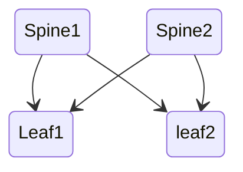

# Cumulus lab

Follow the demo and prepare local network with vagrant

- cumulus-vs community v4.2.1
https://app.vagrantup.com/CumulusCommunity/boxes/cumulus-vx 




Result:
```
vagrant global-status     
id       name    provider   state    directory
-------------------------------------------------------------------------
e629ae5  default virtualbox poweroff C:/code/vagrant/config/local-ubuntu
02190cc  leaf1   virtualbox running  C:/code/lab/Network/BGP-Cumulus     
d9cb568  leaf2   virtualbox running  C:/code/lab/Network/BGP-Cumulus
9ee00bb  spine1  virtualbox running  C:/code/lab/Network/BGP-Cumulus
9584a55  spine2  virtualbox running  C:/code/lab/Network/BGP-Cumulus
```


ref: https://gitlab.com/cumulus-consulting/goldenturtle/cldemo2/
